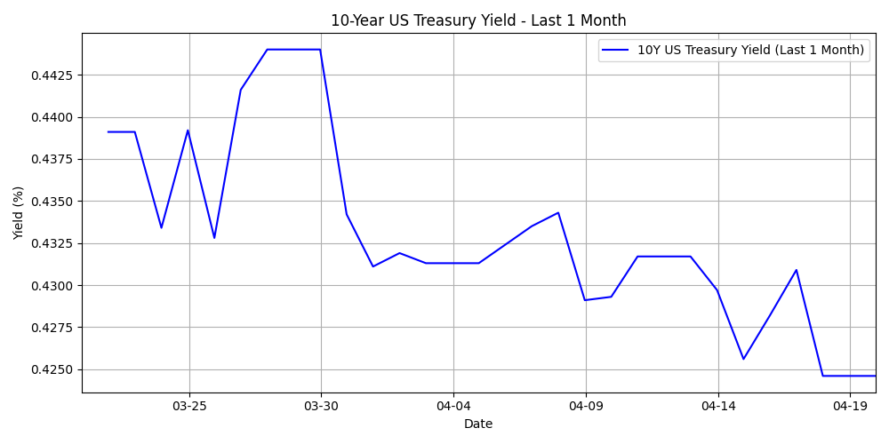

# 📈 US 10-Year Treasury Yield Tracker

A Python-based automated system that fetches, stores, and tracks the daily US 10-Year Treasury Yield from Yahoo Finance using GitHub Actions.

 <!-- ※画像があれば表示されます -->

---

## 🔍 Overview

This app automatically fetches the **10-Year US Treasury yield** every day from Yahoo Finance (`^TNX`) and stores the data in a CSV file. It is useful for:

- Personal finance monitoring
- Macroeconomic trend analysis
- Financial data collection pipelines

---

## 🚀 Features

- 📊 **Daily yield tracking** using GitHub Actions scheduler
- 📁 **Automatic CSV logging** with date and yield
- 🌐 No local server needed — runs fully on GitHub
- 🧠 Extensible for visualization, Slack alerts, or Google Sheets export

---

## 🛠 Tech Stack

| Component         | Description                         |
|------------------|-------------------------------------|
| `Python`         | Core logic scripting                |
| `yfinance`       | Yahoo Finance API wrapper           |
| `pandas`         | CSV handling & data manipulation    |
| `GitHub Actions` | CI/CD for scheduled execution       |

---

## 🧪 How It Works

1. GitHub Actions runs a scheduled job every day (cron)
2. The Python script:
   - Fetches the latest ^TNX data via `yfinance`
   - Appends it to `yield_history.csv`
   - Commits and pushes the update to GitHub

---

## 🕐 Schedule

- Runs **daily at 9 PM JST (12 PM UTC)**
- Managed via GitHub Actions' cron scheduler

```yaml
on:
  schedule:
    - cron: '0 12 * * *'
